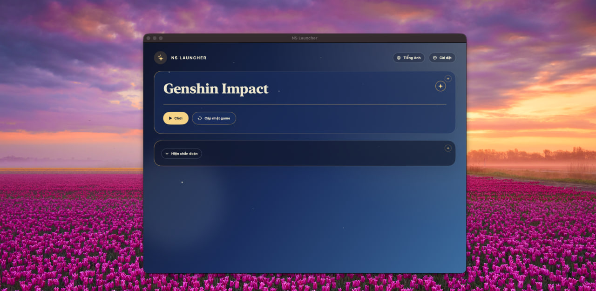
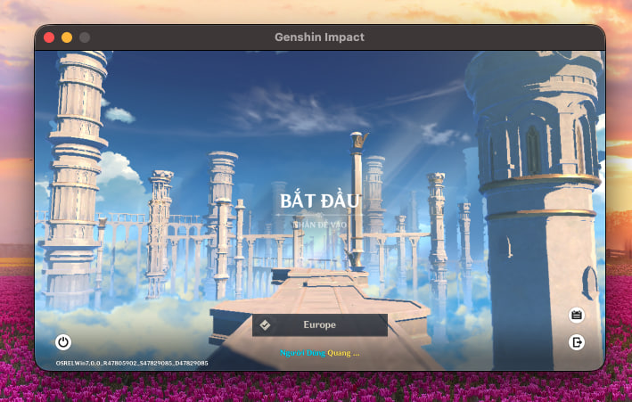

# NS Launcher

Native macOS launcher built with `Swift + SwiftUI` for installing, updating, and
launching the global version of Genshin Impact through Wine.

## Screenshots

## What It Does

- Discovers current HoYoPlay branches and Sophon builds.
- Installs and updates assets with chunk verification, resumable staging, and
  atomic replacement.
- Finds CrossOver or Game Porting Toolkit Wine runtimes and configures D3DMetal,
  DXMT, or plain Wine when available.
- Monitors the actual game process and captures filtered Wine diagnostics.
- Manages launcher settings, selected caches, logs, render snapshots, and
  runtime/container size information.

## Current Status

This is an early-stage launcher for one bundled game definition,
`genshin-global`. It is not a general-purpose game catalog.

The installer uses the game resource manifest for installation and update
planning. Voice manifests are inspected for installed voice-pack inventory and
removal, but voice packs are not downloaded by the launcher.

## Requirements

- macOS 14 or later.
- A compatible Wine build, normally from CrossOver or Game Porting Toolkit. NS
  Launcher can install CrossOver for you from its Settings screen if you don't
  already have one.
- Internet access for HoYoPlay metadata and game chunks.

## Installation

1. Download the latest `NSLauncher-vX.Y.Z-macos.tar.gz` from the
   [Releases page](https://github.com/ngosangns/ns-launcher/releases).
2. Unpack it and move `NSLauncher.app` into `/Applications`.
3. The app is ad-hoc signed, not notarized. On first launch, macOS Gatekeeper
   will block it — right-click the app, choose **Open**, then confirm **Open**
   again in the dialog. This is only needed once.
4. On first run, install or select a Wine runtime from Settings if one isn't
   detected automatically.

## Using The Launcher

- The Home tab shows the game hero with **Play**, **Update**, and a
  diagnostics drawer for the current operation's progress and logs.
- Installing or updating downloads and verifies game assets directly from
  HoYoPlay's Sophon CDN; you don't need the official launcher installed.
- Settings covers the Wine runtime, render backend (D3DMetal, DXMT, or
  plain Wine), compatibility toggles (cloud compatibility, Steam-parent mode,
  AC patching, network blocking, proxy, HDR, Retina, Metal HUD, resolution,
  timeout fixes), install location, and cache management.

These Wine-based workarounds are not supported by HoYoverse and may carry
account or stability risks. Runtime behavior depends on the installed Wine
build.

## Sophon Install Flow

The launcher uses HoYoPlay Sophon metadata for both fresh install and update:

1. fetch `getGameBranches` and Sophon `getBuild`;
2. select the game resource manifest and inspect the user-selected voice manifest;
3. download and decode zstd-compressed protobuf manifests;
4. compare local assets by size and MD5;
5. prune files outside the target Sophon asset set while protecting the Wine
   prefix, launcher metadata, and `GenshinImpact_Data/Persistent` (the client's
   own resource downloads and version bookkeeping);
6. download missing or mismatched chunks;
7. decompress and verify each chunk;
8. write chunks into staging files by offset;
9. verify the final asset MD5 and atomically replace the destination;
10. write `.nslauncher-install.json` only after the expected executable exists.

Archive packages, local archive install, generic JSON manifests, and the old
`pkg_version`/file-level streaming path are no longer product paths.

## Building From Source Or Contributing

See [developer.md](developer.md) for build setup, architecture, test commands,
runtime data paths, and the release workflow.
